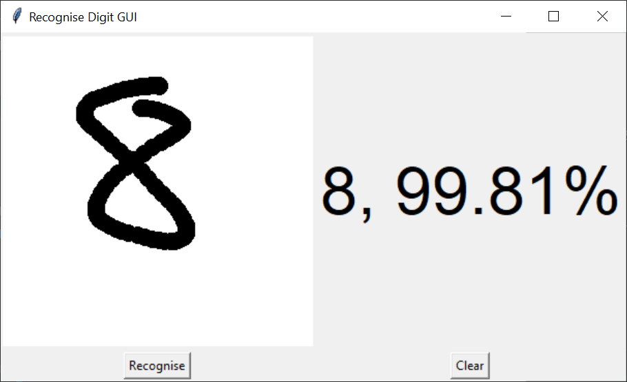

# Digit Recognition with MNIST dataset  
## Overview  
The MNIST handwritten digit classification problem is a standard dataset used in computer vision and deep learning.  

## About files  
- [digit_recog.py](https://github.com/thanhtvt/ML-DL-projects/blob/main/digit_recognition/digit_recog.py): Training and validating model to predict/recognise digits from mnist dataset.
- [mnist.h5](https://github.com/thanhtvt/ML-DL-projects/blob/main/digit_recognition/mnist.h5): Saved model after training successfully.
- [recog_gui.py](https://github.com/thanhtvt/ML-DL-projects/blob/main/digit_recognition/recog_gui.py): GUI for drawing digits which are recognised by model (old one).  
- [digit_recognition_Gradio.ipynb](https://github.com/thanhtvt/ML-DL-projects/blob/main/digit_recognition/digit_recognition_Gradio.ipynb): UI created for classification by Gradio.

## Version
### Ver 1:   
- Prediction with test set of MNIST has great result (99.993% accuracy)
- Prediction with digit drawn on Canvas does not have great result 
  
### Ver 2:
- Update GUI using [Gradio](https://www.gradio.app/) (a great tools to generate an easy-to-use UI for ML model)  
- Improve prediction accuracy when drawing on sketchboard

### Future updates:
[x] Improve accuracy of GUI prediction (with [Gradio](https://www.gradio.app/))  
[ ] Addfeature to upload image into GUI prediction  

## Image of GUI (old one)  
  
  
## Preview of Gradio's UI
  
  
## References
- [Deep Learning cơ bản - Nguyễn Thanh Tuấn](https://drive.google.com/file/d/1lNjzISABdoc7SRq8tg-xkCRRZRABPCKi/view)
- [Handwritten Digit Recognition using Python](https://data-flair.training/blogs/python-deep-learning-project-handwritten-digit-recognition/)
- [Gradio - Interfaces for your ML Models](https://www.gradio.app/)
