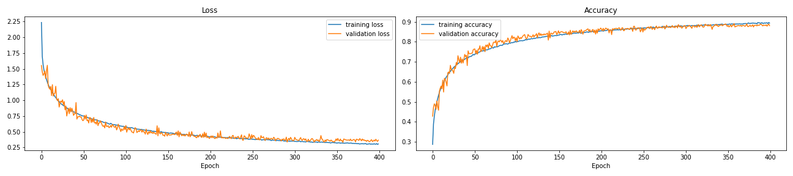
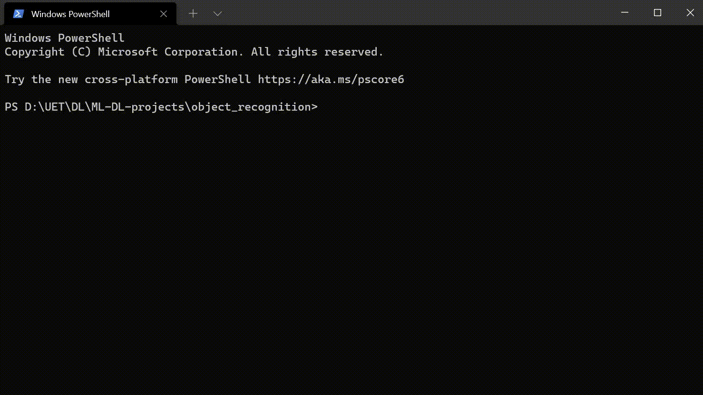

# Object Recognition with Cifar10 dataset  
## Overview  
CIFAR-10  is an established computer-vision dataset used for object recognition. It is a subset of the 80 million tiny images dataset and consists of 60,000 32x32 color images containing one of 10 object classes, with 6000 images per class.  

## About files  
- [cifar_recog.py](https://github.com/thanhtvt/ML-DL-projects/blob/main/object_recognition/cifar_recog.py): Training and validating model to predict/recognise object from cifar10 dataset.
- [cifar10.h5](https://github.com/thanhtvt/ML-DL-projects/blob/main/object_recognition/cifar10.h5): Saved model after training successfully.
- [cifar_gui.py](https://github.com/thanhtvt/ML-DL-projects/blob/main/object_recognition/cifar_gui.py): GUI for inputing image which are recognised by model.  

## About  
Learning rate of this model:  

## Preview of GUI  
  
  
## Installation
- [tensorflow](https://www.tensorflow.org/): `pip install tensorflow`
- [keras](https://keras.io/): `pip install keras`
- [scikit-learn](https://scikit-learn.org/): `pip install scikit-learn`
- [tkinter](https://docs.python.org/3/library/tkinter.html): `pip install tkinter`
- [numpy](https://numpy.org/): `pip install numpy`
  
## References
- [Deep Learning cơ bản - Nguyễn Thanh Tuấn](https://drive.google.com/file/d/1lNjzISABdoc7SRq8tg-xkCRRZRABPCKi/view)
- [How to Develop a CNN From Scratch for CIFAR-10 Photo Classification](https://machinelearningmastery.com/how-to-develop-a-cnn-from-scratch-for-cifar-10-photo-classification/)
